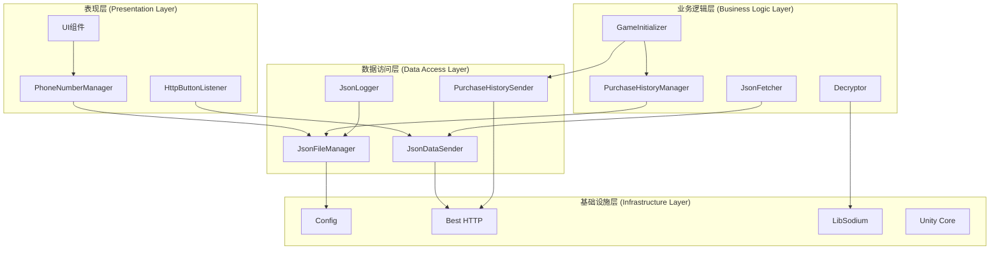
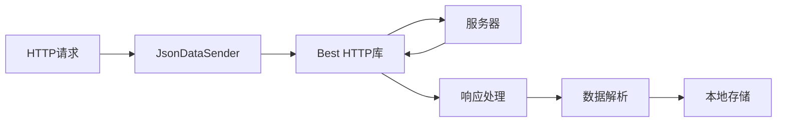
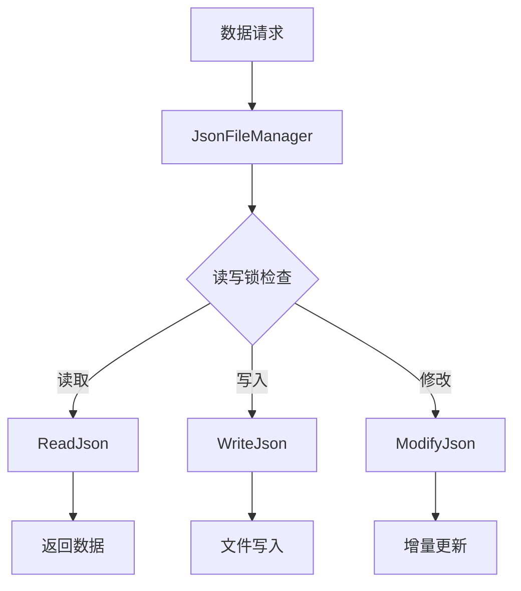
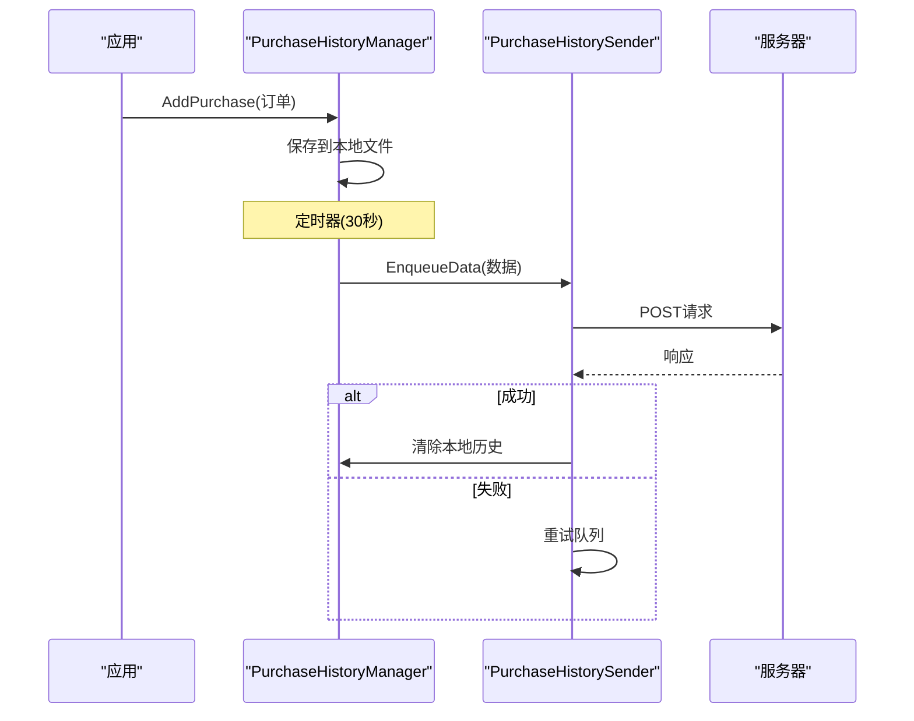

# NetNode

> 基于Unity的网络通信、数据加密与JSON处理系统

## 项目概述

NetNode是一个基于Unity开发的综合性网络通信框架，专注于提供安全的数据传输、高效的HTTP通信以及便捷的JSON数据处理功能。该项目主要面向需要在Unity环境中处理网络请求、数据安全加密以及本地数据存储的开发者。

### 核心特性
- 🌐 **安全网络通信**: 基于Best HTTP库的HTTP/HTTPS请求处理
- 🔐 **数据加密保护**: 集成libsodium加密库，支持AES-GCM等现代加密算法
- 📊 **JSON数据管理**: 完整的JSON读写、缓存和日志记录系统
- 📱 **购买历史管理**: 支持本地存储与云端同步的购买记录管理
- 🎯 **配置化设计**: 基于ScriptableObject的灵活配置管理
- 🧵 **线程安全**: 完善的并发控制和线程安全机制

## 技术架构

### 整体架构图



### 核心组件架构

#### 1. 初始化与管理系统

**GameInitializer**: 系统启动入口
- 负责初始化`PurchaseHistoryManager`和`PurchaseHistorySender`
- 确保核心组件在游戏启动时正确配置
- 采用单例模式保证全局唯一性

#### 2. 网络通信模块



**核心组件**:
- `JsonDataSender`: HTTP请求封装器，支持GET/POST请求
- `JsonFetcher`: 专门处理远程JSON配置获取
- `PurchaseHistorySender`: 购买历史数据上传管理
- `HttpButtonListener`: UI交互的HTTP请求处理

#### 3. 数据管理系统



**JsonFileManager特性**:
- 线程安全的文件读写操作
- 支持泛型JSON序列化/反序列化
- 提供读写锁机制，支持并发读取
- 增量更新和列表项添加功能

#### 4. 数据加密模块

**Decryptor & SimpleDecryptor**:
- 基于libsodium的AES-GCM加密
- 支持密钥派生和安全随机数生成
- 提供简化和完整两种加密接口
- 异步加密处理，避免阻塞主线程

#### 5. 购买历史管理



## 技术选型

### 核心依赖库

| 库名称 | 版本 | 功能描述 |
|--------|------|----------|
| **com.tivadar.best.http** | 3.0.16 | 高性能HTTP通信库，支持HTTP/2、缓存、认证等 |
| **unity.libsodium** | 0.2.2 | 现代加密库，提供AES-GCM、XChaCha20-Poly1305等算法 |
| **LitJson** | 内置 | 轻量级JSON序列化库 |
| **TextMesh Pro** | 内置 | Unity高质量文本渲染 |

### Unity模块依赖

```json
{
  "核心模块": [
    "com.unity.ugui",
    "com.unity.inputsystem", 
    "com.unity.addressables",
    "com.unity.burst"
  ],
  "渲染模块": [
    "com.unity.render-pipelines.universal"
  ],
  "2D支持": [
    "com.unity.2d.aseprite",
    "com.unity.2d.tilemap.extras"
  ]
}
```

## 封装功能详解

### 1. HTTP通信封装

**JsonDataSender**提供了统一的HTTP请求接口:

```csharp
// GET请求示例
JsonDataSender.SendJsonViaGet<ResponseType>(url, onSuccess, onError);

// POST请求示例
JsonDataSender.SendJsonViaPost<RequestType, ResponseType>(url, data, onSuccess, onError);
```

**特性**:
- 泛型支持，自动序列化/反序列化
- 统一的错误处理机制
- 请求队列管理
- 超时和重试机制

### 2. 数据持久化封装

**JsonFileManager**提供线程安全的文件操作:

```csharp
// 读取JSON数据
var data = JsonFileManager.Instance.ReadJson<UserData>("user.json");

// 写入JSON数据
JsonFileManager.Instance.WriteJson("user.json", userData);

// 增量更新
JsonFileManager.Instance.ModifyJson("config.json", partialUpdate);
```

### 3. 配置管理封装

**Config ScriptableObject**提供灵活的配置管理:

```csharp
[CreateAssetMenu(fileName = "Config", menuName = "Scriptable Objects/Config")]
public class Config : ScriptableObject
{
    public string pullUrl;           // 数据拉取URL
    public string serverUrl;         // 服务器地址
    public float getRequestInterval; // GET请求间隔
    public float postRequestInterval;// POST请求间隔
    public string testPostUrl;       // 测试POST地址
    public string configJsPath;      // 配置JS路径
    public string dataJsPath;        // 数据JS路径
}
```

### 4. 加密功能封装

**加密服务**基于libsodium提供:

- **AES-GCM加密**: 高性能对称加密
- **密钥派生**: 基于PBKDF2的安全密钥生成
- **随机数生成**: 密码学安全的随机数
- **流加密**: 支持大文件的流式加密

### 5. 用户界面封装

**PhoneNumberManager**提供完整的手机号管理:
- 输入验证和格式化
- 号码脱敏显示
- 本地存储持久化
- UI状态管理

## 项目结构

```
NetNode/
├── Assets/
│   ├── Scripts/                 # 核心业务逻辑
│   │   ├── GameInitializer.cs   # 系统初始化
│   │   ├── JsonFetcher.cs       # JSON配置获取
│   │   ├── PurchaseHistoryManager.cs  # 购买历史管理
│   │   ├── PurchaseHistorySender.cs   # 数据上传
│   │   ├── Decryptor.cs         # 加密解密服务
│   │   └── SimpleDecryptor.cs   # 简化加密接口
│   ├── tt/Script/              # UI和数据管理
│   │   ├── Config.cs           # 配置管理
│   │   ├── JsonFileManager.cs  # 文件操作
│   │   ├── JsonDataSender.cs   # HTTP通信
│   │   ├── PhoneNumberManager.cs # 手机号管理
│   │   ├── JsonLogger.cs       # 日志记录
│   │   └── HttpButtonListener.cs # UI交互
│   ├── unity.libsodium/        # 加密库
│   └── TextMesh Pro/           # 文本渲染
├── Packages/
│   ├── com.tivadar.best.http/  # HTTP通信库
│   └── manifest.json           # 包依赖管理
└── ProjectSettings/            # Unity项目设置
```

## 设计模式应用

### 1. 单例模式 (Singleton)
- `JsonFileManager`: 全局文件访问管理
- `PurchaseHistoryManager`: 购买历史统一管理
- `PurchaseHistorySender`: 全局数据发送服务

### 2. 观察者模式 (Observer)
- HTTP响应事件处理
- UI状态变化通知
- 购买事件监听

### 3. 工厂模式 (Factory)
- JSON数据对象创建
- HTTP请求对象构建
- 加密算法选择

### 4. 策略模式 (Strategy)
- 不同加密算法切换
- 多种数据存储方式
- 网络请求重试策略

## 开发环境

### 必需工具
- **Unity Editor**: 2021.1+
- **Visual Studio** 或 **JetBrains Rider**: C#开发环境
- **Python 3.x**: 加密脚本支持

### 构建和运行

1. **本地开发**:
   ```bash
   # 打开Unity项目
   # 运行Game场景进行测试
   ```

2. **构建部署**:
   - 支持Android/iOS/PC多平台
   - 通过Unity Build Settings配置目标平台
   - 自动化CI/CD支持

## 安全考虑

### 数据安全
- 使用libsodium现代加密算法
- 敏感数据本地加密存储
- 网络传输HTTPS加密
- 密钥安全管理

### 线程安全
- 文件操作读写锁保护
- HTTP请求主线程执行
- 加密操作异步处理
- 单例双重检查锁定

## 性能优化

### 网络优化
- HTTP连接复用
- 请求队列管理
- 响应缓存机制
- 超时和重试控制

### 存储优化
- 增量数据更新
- 文件读写缓存
- 并发读取支持
- 内存使用优化

## 扩展指南

### 添加新的数据类型
1. 在`JsonDataClasses.cs`中定义数据模型
2. 使用`JsonFileManager`进行持久化
3. 通过`JsonDataSender`实现网络同步

### 集成新的加密算法
1. 扩展`Decryptor`类添加新算法
2. 在`Config`中配置算法参数
3. 更新相关的Python脚本

### 自定义UI组件
1. 继承现有的Manager类
2. 实现数据绑定和验证逻辑
3. 集成到`GameInitializer`初始化流程

## 故障排除

### 常见问题
1. **网络请求失败**: 检查Config配置和网络连接
2. **加密解密错误**: 验证密钥和算法参数
3. **文件访问异常**: 确认文件权限和路径设置
4. **UI响应问题**: 检查主线程调度和事件绑定

### 调试工具
- `JsonLogger`: 记录详细的操作日志
- Unity Console: 查看运行时错误信息
- Network Profiler: 分析网络请求性能

## 许可证

本项目使用的第三方库许可证:
- **Best HTTP**: [商业许可证](https://bestdocshub.pages.dev/HTTP/)
- **LibSodium**: [MIT许可证](https://github.com/jedisct1/libsodium/blob/master/LICENSE)
- **LitJson**: [Public Domain](https://litjson.net/)

---

> 🔧 **技术支持**: 如有问题请查看项目文档或提交Issue
> 📚 **学习资源**: 详细的API文档和示例代码请参考`/Assets/tt/Script/需求.md`